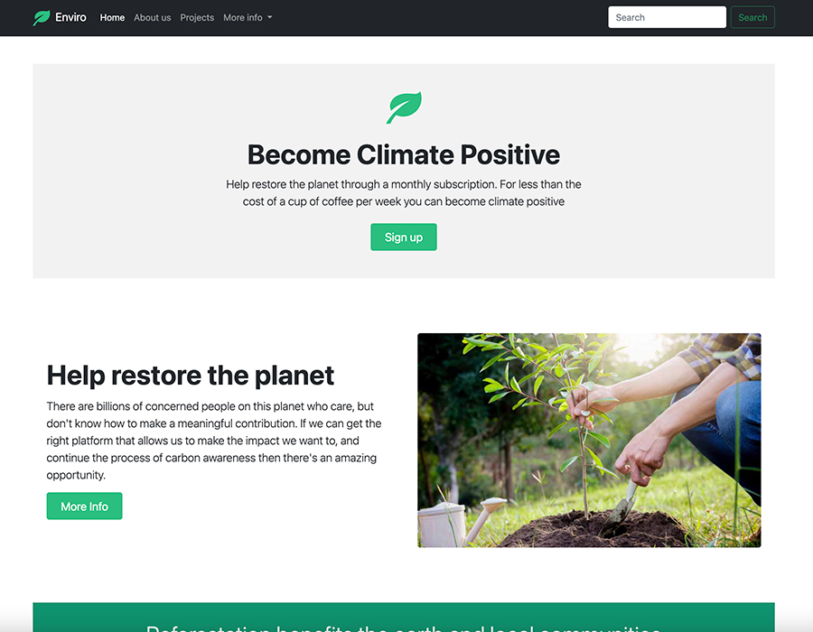

# Enviro - Responsive Bootstrap landing page

This is a solution to an environmental organisation landing page. It's a monthly subscription site where members can plant trees to offset their carbon footprint. In the process of building this single page I managed to gain a greater understanding of Bootstrap's grid system, components, utilities and be able to create websites that can adapt to every device and every screen size.

## Table of contents

- [Overview](#overview)
  - [The challenge](#the-challenge)
  - [Screenshot](#screenshot)
  - [Links](#links)
- [My process](#my-process)
  - [Built with](#built-with)
  - [What I learnt](#what-i-learnt)
  - [Useful resources](#useful-resources)
- [Author](#author)
- [License](#license)

## Overview

### The challenge

Users should be able to:

- View the optimal layout depending on their device's screen size
- Interact with the Navbar dropdown menu and return home

### Screenshot



Above is what you should see when you click on the link below.

### Links

- GitHub URL: [Code](https://github.com/Max88-git/enviro-bootstrap)
- Live Site URL: [Live Site](https://max88-git.github.io/enviro-bootstrap/)

## My process

### Built with

- Semantic HTML5 markup
- Custom CSS properties
- JavaScript
- Bootstrap 5.1.3
- Bootstrap Icons 1.7.2

### What I learnt

- I learnt how to build a modern, responsive website using Bootstrap 5.
- How to install Bootstrap via CDN.
- The concept of the grid system and how the content should adjust and change size according to the screen size.
- Learnt how to use components such as buttons, cards and navbar.
- How to work with Bootstrap utilities which include display, spacing, sizing and flex.
- Layout considerations for both desktop and mobile devices.

Here is a code snippet I am proud of:

```html
<!-- Newsletter subscription -->
<div class="col-lg-5 col-md-5 offset-lg-1 offset-md-1 mb-4">
  <form>
    <h5 class="text-white">Subscribe to our newsletter</h5>
    <p class="text-muted">Monthly digest of whats new and exciting from us.</p>
    <div class="d-flex w-100 gap-2">
      <label for="newsletter1" class="visually-hidden">Email address</label>
      <input
        id="newsletter1"
        type="text"
        class="form-control"
        placeholder="Email address"
      />
      <button class="btn btn-primary" type="button">Subscribe</button>
    </div>
  </form>
</div>
```

### Useful resources

- [Bootstrap Docs](https://getbootstrap.com/docs/5.1/getting-started/introduction/) -This helped me learn about all the different components, content and utilities Bootstrap has in it's collection.
- [Bootstrap Icons](https://icons.getbootstrap.com/) - Bootstrap now has it's own open source icon library of over 1,500 icons which is very helpful. I found it very easy to install them using a CDN in my website <head> and embed the icons within the HTML of the page.
- [SVG styling](https://stackoverflow.com/questions/24933430/img-src-svg-changing-the-styles-with-css) - This Stack Overflow question helped me to figure out how to change the fill color on my svg social media icons.

## Author

- Website - [Max Lockwood](https://www.maxlockwood.uk/)

## License

This project is licensed under the terms of the MIT license. A short and simple permissive license with conditions only requiring preservation of copyright and license notices. Licensed works, modifications, and larger works may be distributed under different terms and without source code.

MIT &#169; Max Lockwood
